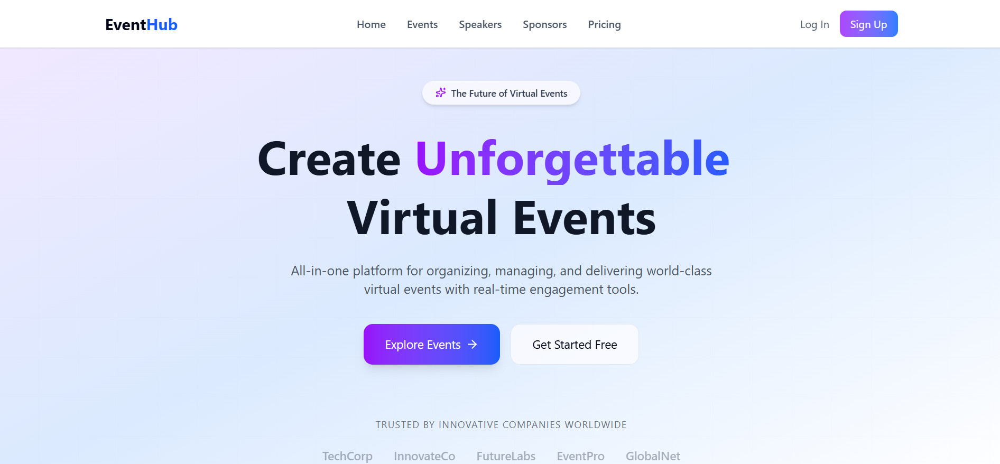
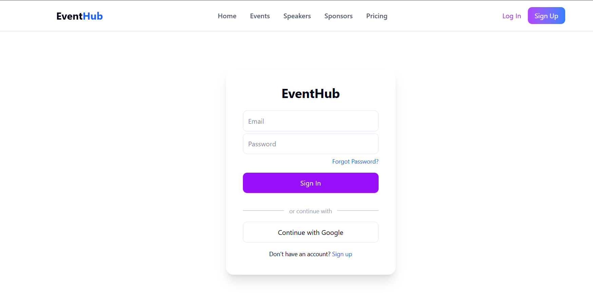
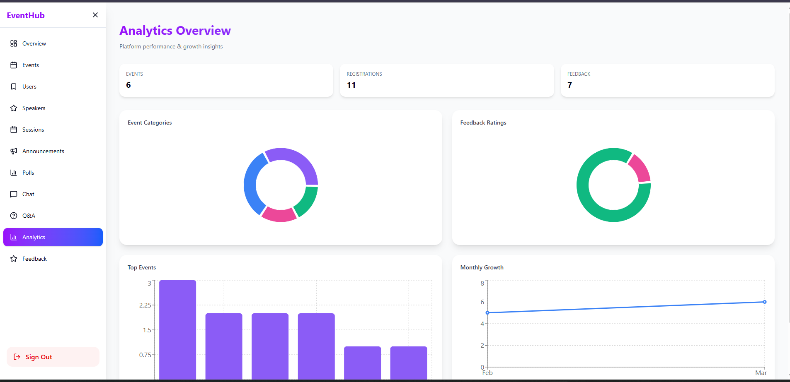
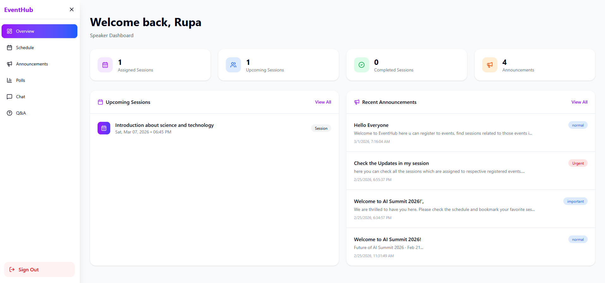
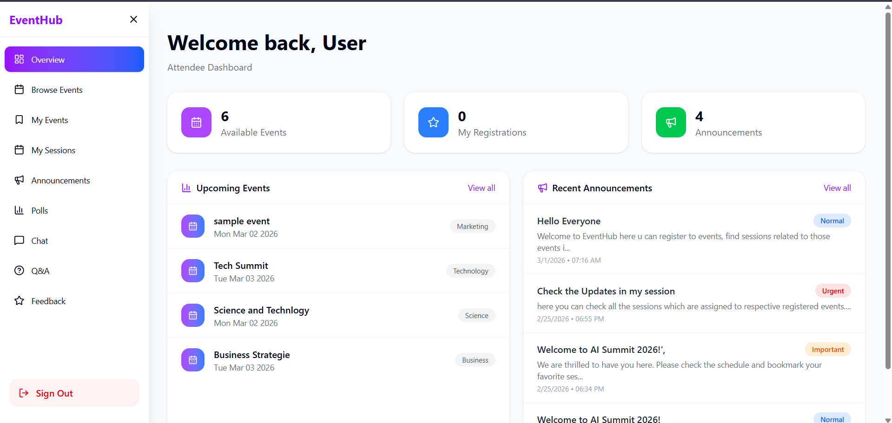

# 🚀 EventHub  
### Modern Online Event Management Platform (Frontend)

<p align="center">
  <strong>Discover • Register • Manage • Engage</strong><br/>
  Built with React, Supabase & Modern Web Technologies
</p>

---

## 📖 Project Description

EventHub is a full-featured Event Management Web Application that allows users to browse events, register, participate in sessions, vote in polls, and manage dashboards based on roles.

This repository contains the **Frontend Application**, built using **React (Vite)** and deployed on **Netlify**.

The system supports three roles:

- 👑 Admin  
- 🎤 Speaker  
- 👤 Attendee  

Each role has a dedicated dashboard with protected access.

---

## ✨ Features

### 🔐 Authentication
- Email & Password Login
- Google OAuth Login (Supabase)
- Role-Based Redirection
- Protected Routes
- Forgot Password (Reset link sent via email)

> Users can request a password reset email and securely update their password using the reset link.

---

### 🎟 Event System
- Browse all events
- View event details
- Register for events
- Cancel registrations
- Simulated ticket confirmation

---

### 👑 Admin Dashboard
- Create / Edit / Delete events
- Assign speakers
- Manage sessions
- Manage users
- Create & manage polls
- View analytics
- Manage announcements
- View feedback

---

### 🎤 Speaker Dashboard
- View assigned sessions
- Update meeting links
- View announcements
- Access polls

---

### 👤 User Dashboard
- View registered events
- Participate in polls
- Submit feedback
- View session schedules

---

## 🛠 Tech Stack

**Frontend:**  
- React (Vite)  
- React Router  
- Axios  
- Supabase Authentication  
- Tailwind CSS  
- React Toastify  

**Deployment:**  
- Netlify  

---

## 🏗 Architecture

```
User → React Frontend → Express Backend → Supabase Database
```

Authentication Flow:

```
User → Login / Google OAuth → Backend Role Check → Dashboard Redirect
```

---

## 📂 Project Structure

```
src/
 ├── components/
 ├── pages/
 ├── layouts/
 ├── lib/
 ├── App.jsx
 └── main.jsx
```

---

## ⚙️ Installation Steps (Local Setup)

### 1️⃣ Clone Repository
```bash
git clone <your-frontend-repo-link>
cd frontend-folder
```

### 2️⃣ Install Dependencies
```bash
npm install
```

### 3️⃣ Create Environment File

Create `.env` file:

```env
VITE_API_URL=http://localhost:5000
VITE_SUPABASE_URL=your_supabase_project_url
VITE_SUPABASE_ANON_KEY=your_supabase_anon_key
```

### 4️⃣ Start Development Server
```bash
npm run dev
```

App runs on:
```
http://localhost:5173
```

---

## 🌍 Deployment

🌐 **Live Website (Netlify):**  
https://jade-jalebi-b3bfec.netlify.app  

🔗 **Connected Backend API (Render):**  
https://online-event-management-backend-85md.onrender.com  

---

## 🔑 Demo Login Credentials

### 👑 Admin
Email: admin@gmail.com  
Password: 123456

### 🎤 Speaker
Email: vemularupa19@gmail.com  
Password: 123456 

### 👤 Attendee
Email: user2@gmail.com  
Password: 123456

Or use **Google Login**.

---

## 🔐 Security Features

- Role-based route protection
- Token-based authentication
- Backend role verification
- Secure API communication

---

## 📸 Screenshots

(Add screenshots here)

- Home Page  

- Login Page  

- Admin Dashboard  

- Speaker Dashboard  

- User Dashboard  

- Analytics Page  

---

## 🎥 Video Walkthrough

Demo Video Link:  
https://drive.google.com/file/d/1rBFbQBVKj_C1FlaY3mUwkXlv3po1Kg_S/view?usp=drivesdk  

---

## ☁️ Deployment Requirements

✔ Backend deployed on Render  
✔ Frontend deployed on Netlify  
✔ Backend API integrated into frontend via environment variables  

---

## 📌 Project Highlights

- Role-Based Dashboards  
- Google OAuth Integration  
- Forgot Password System  
- Event Registration System  
- Poll & Feedback Modules  
- Admin Analytics  
- Fully Deployed Production Application  

---

### 👨‍💻 Developed as part of Full Stack Web Application Project